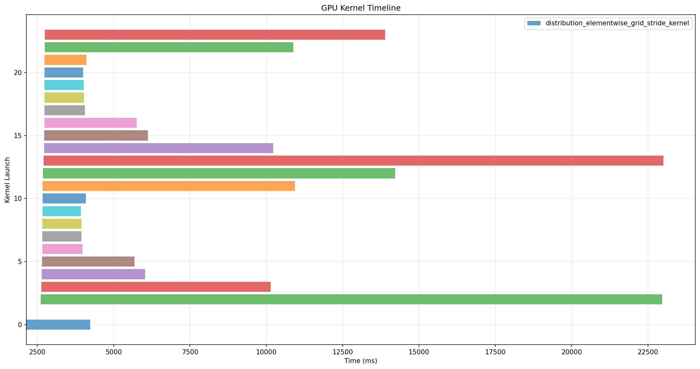

# Butterfly Matrix Multiplication Kernel

A high-performance implementation of butterfly matrix multiplication using Triton GPU kernels, with comprehensive testing, profiling, and benchmarking tools.

## Overview

This project implements butterfly matrix multiplication, which decomposes matrix multiplication into a series of structured operations. The implementation includes:

- **Triton GPU kernel** for high-performance computation
- **Reference implementation** for correctness validation
- **Comprehensive testing framework** with both pytest and standalone testing
- **Profiling tools** for performance analysis and optimization
- **Benchmarking suite** for performance comparison

## PyTorch Module Wrapper: ButterflyLayer

A minimal PyTorch `nn.Module` wrapper is provided for the Triton butterfly matrix multiplication kernel. This allows you to use the butterfly operation as a drop-in layer in PyTorch models.

**File:** `butterfly_module.py`

**Example usage:**

```python
from butterfly_module import ButterflyLayer
import torch

B, F, L = 8, 16, 32  # Batch, features, length (L must be power of 2)
x = torch.randn(B, F, L, device='cuda')

layer = ButterflyLayer(F, L).cuda()
y = layer(x)
print(y.shape)  # (B, F, L)
```

- The layer exposes learnable butterfly parameters (`W_par`).
- For autograd support, ensure the kernel or reference backward is used.

## Project Structure

```
butterfly_matrix_kernel/
├── triton_kernel.py              # Main Triton GPU kernel implementation
├── reference_impl.py             # Reference torch implementation for validation
├── butterfly_module.py           # PyTorch nn.Module wrapper for butterfly kernel
├── unittests/                    # Pytest-based unit tests
│   ├── __init__.py
│   ├── test_correctness.py       # Unit tests for correctness
│   └── test_numwarp_tuning.py    # Unit tests for num_warps tuning
├── testing/                      # Standalone testing framework
│   └── correctness_harness.py    # Comprehensive test suite
├── profiling/                    # Performance profiling tools
│   ├── torch_profiler.py         # PyTorch profiler with NVTX markers
│   ├── memory_profiler.py        # Memory usage profiling
│   └── visualization.py          # SQLite visualization for Nsight Systems
├── benchmarking/                 
│   └── performance_bench.py      # Performance comparison benchmarks
├── optimization/                 # Hyperparameter tuning scripts
│   ├── pipelined_kernel.py       # one-step pipelining
│   ├── fused_kernel.py           # two-stage kernel for L=8
│   └── numwarp_tuning.py         # Script for tuning num_warps
├── results/                      
│   ├── profiles/                 # Profiling results
│   ├── benchmarks/               # Benchmark results
│   ├── plots/                    # Generated plots
│   └── optimization/             # Tuning results
└── scripts/                      # Wrapper scripts
    ├── run_profiling.py          # Run all profiling tools
    └── run_benchmarks.py         # Run performance benchmarks
```

## Quick Start

### Prerequisites

- Python 3.10+ (verified working on Python 3.12)
- uv (Python package manager) - [Install uv](https://docs.astral.sh/uv/getting-started/installation/)
- NVIDIA GPU with compute capability 7.0+

### Installation

```bash
# Clone the repository
git clone https://github.com/kiaghods/butterfly_matrix_kernel.git
cd butterfly_matrix_kernel

# Create and activate virtual environment with uv
uv venv
source .venv/bin/activate

uv pip install -r requirements.txt
```


## Testing

### Unit Testing (pytest) - Correctness & Numerical Precision

Run the pytest-based unit tests:

```bash
# Run all tests
pytest unittests/

# Run specific test file
pytest unittests/test_correctness.py

# Run with verbose output
pytest unittests/ -v
```

The pytest tests use the same `check_case` function from `correctness_harness.py` and tests various input configurations.

## Profiling

### PyTorch Profiler

Profile the implementation using PyTorch's built-in profiler:

```bash
python profiling/torch_profiler.py
```

This generates:
- Profiler summary with operator statistics
- NVTX markers for kernel identification

### Memory Profiling

Profile memory usage patterns:

```bash
python profiling/memory_profiler.py
```

This tracks:
- GPU memory allocation/deallocation
- Peak memory usage
- Memory efficiency metrics

### Nsight Systems Profiling

For detailed kernel-level profiling:

```bash
# Profile with Nsight Systems
nsys profile -o results/profiles/butterfly_profile python profiling/torch_profiler.py

# Export to SQLite for analysis
nsys export results/profiles/butterfly_profile.qdrep --type sqlite results/profiles/butterfly_profile.sqlite

# Visualize the results
python profiling/visualization.py results/profiles/butterfly_profile.sqlite
```

### Convenience Scripts

Use the wrapper scripts for easy profiling:

```bash
# Run all profiling tools
python scripts/run_profiling.py

# Run specific profiling tool
python scripts/run_profiling.py --tool torch
python scripts/run_profiling.py --tool memory
python scripts/run_profiling.py --tool nsight
```

### Kernel Timeline Visualization

The following timeline plot shows the execution of the butterfly kernel, generated using Nsight Systems and the provided visualization script:



## Benchmarking

### Performance Benchmarks

Run performance benchmarks to compare implementations:

```bash
python benchmarking/performance_bench.py
```

This compares:
- Triton kernel vs reference implementation vs dense matmul
- Performance (runtime, memory) across different input sizes

### Convenience Script

```bash
python scripts/run_benchmarks.py
```

## Results Analysis

### Profiling Results

Profiling results are stored in `results/profiles/`:
- SQLite databases (`.sqlite`) for Nsight Systems analysis
- Memory profiling reports

### Benchmark Results

Benchmark results are stored in `results/benchmarks/`:
- Performance comparison data
- Timing statistics
- Memory usage reports

### Visualization

The `profiling/visualization.py` script provides:
- Kernel duration distribution plots
- Timeline visualization
- Performance tier analysis

## Optimizations (some attempts)

### Parameter Tuning

Butterfly kernel performance is optimized by tuning key parameters:
- **BLOCK_BF** (rows per Triton program)
- **num_warps** (CUDA warps per kernel)

The script `optimization/numwarp_tuning.py` benchmarks different `num_warps` values (4, 8, 16) for a range of problem sizes and records the best-performing configuration. Empirical results show that for sequence lengths L ≤ 2048, `BLOCK_BF = 64` consistently yields the best performance. The optimal `num_warps` value depends on the problem size and GPU, typically 4 or 8 for the given constraints. 

### Pipelining

A "pipelined" butterfly kernel was implemented in `optimization/pipelined_kernel.py`. This kernel prefetches the next pair's data and coefficients while computing/storing the current pair, overlapping memory loads with computation.

- The pipelined kernel is functionally correct (outputs match the baseline).
- However, it is consistently *slower* than the baseline kernel on modern GPUs (see `results/optimization/pipelined_vs_baseline_results.csv`).
- This matches the findings in the literature: modern GPU hardware already overlaps loads and compute within a warp, so manual software pipelining does not provide a speedup and can even reduce performance due to increased register pressure and instruction count.

### Kernel Fusion (minimal working ex.)

This project includes a highly optimized fused kernel for applying two butterfly stages in a single Triton kernel, specifically for the case where L=8. 

*Quick Explanation:*
Kernel fusion refers to combining multiple computational steps (that would normally require separate GPU kernel launches) into a single GPU kernel. 

*Our Case - The Two-Stage Butterfly Approach:*
In the butterfly matrix multiplication algorithm, each stage applies a set of 2x2 butterfly transformations to pairs of elements. For L=8, there are three stages in total, but this kernel fuses the first two stages into a single Triton kernel. This means both stages are computed in one pass, keeping all intermediate results in fast registers rather than writing to and reading from global memory between stages.

Fusing multiple butterfly stages is challenging because the pairing pattern changes at each stage, and the data dependencies become more complex as L increases. Writing a generic fused kernel for arbitrary L would require intricate indexing logic and potentially large register usage, which was difficult to write given the time constraint.

To sidestep these challenges and maximize performance, I hard-coded the butterfly pairings and update logic for L=8. All butterfly operations for both stages are fully unrolled and implemented using only Triton primitives. This approach is not general, but it is extremely efficient and numerically exact for this small, fixed size.

The fused kernel is implemented in [`optimization/fused_kernel.py`](optimization/fused_kernel.py).

### Benchmark Result
```
[B=4 F=64 L=8] Baseline: 0.06 ms | Fused: 0.04 ms | Max diff: 0.00e+00
```

*Usage:*
This approach is ideal for small L (e.g., L=8), where kernel launch overhead is (relatively) significant compared to computation. For larger L, a more general or pipelined approach is preferable.

